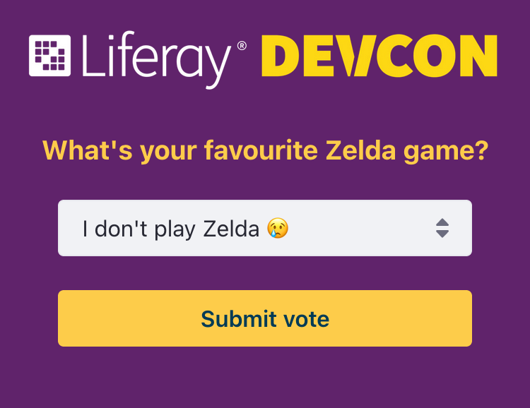

# Liferay Devcon 2023 Headless Talk
The demo consisted on a poll built with [Liferay Objects](https://learn.liferay.com/w/dxp/building-applications/objects). Here you can find the resources used:

- [Presentation slides](https://docs.google.com/presentation/d/1Ah7eROPrFVuC6kHQZ5PzmJlfs2Nsg4avQ4xcFVEgFp0/edit?usp=sharing).
- Batch files:
    - [Poll object definitions](batch/definitions.json).
    - [Zelda poll data](batch/zelda-poll.json).
- Freemarker templates:
    - [Vote page](templates/vote.ftl).
    - [Results page](templates/results.ftl).

## Results
These was the voting page:

And these were the final results:

